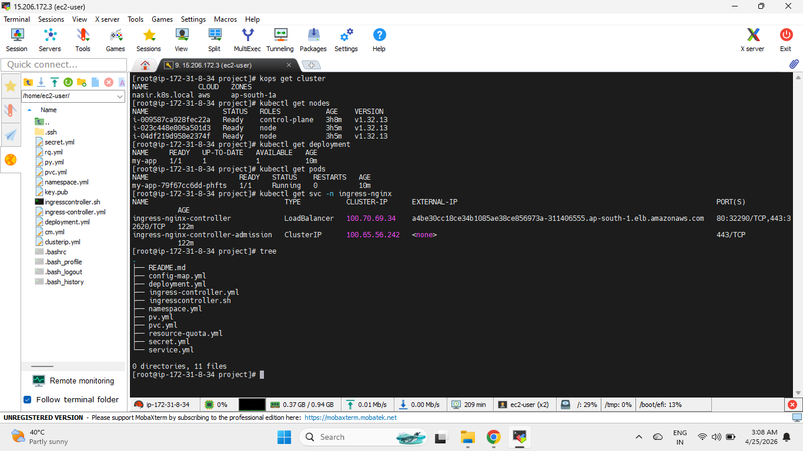
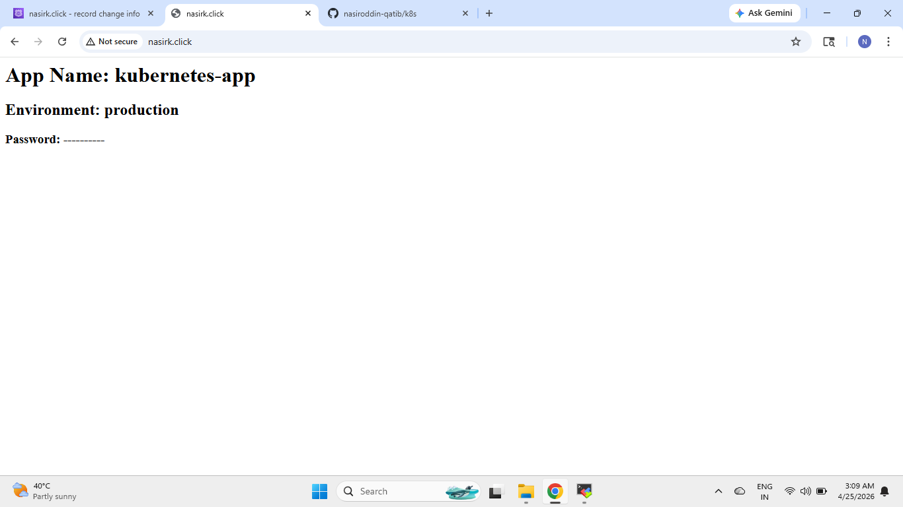

# 🚀 Kubernetes Production Environment on AWS

## 📌 Project Overview

This project demonstrates a production-style Kubernetes setup deployed on AWS using KOPS.

In this project, I created a Kubernetes cluster on AWS EC2 instances and deployed an NGINX-based application using Kubernetes resources such as:

- Deployment
- Service
- Ingress Controller
- ConfigMap
- Secret
- Persistent Volume
- Persistent Volume Claim
- Resource Quota
- Namespace

The application is exposed publicly using an NGINX Ingress Controller and custom domain routing.

---

# 🧭 Project Architecture

Internet User  
↓  
NGINX Ingress Controller  
↓  
ClusterIP Service  
↓  
Deployment / Pod  
↓  
Persistent Volume (AWS EBS)

---

# ⚙️ Technologies Used

- Kubernetes
- KOPS
- AWS EC2
- AWS EBS
- NGINX Ingress Controller
- YAML
- Linux

---

# 📂 Project Structure

```bash
k8s/
│
├── screenshots/
│   ├── kubernetes-cluster-setup.png
│   └── kubernetes-app-output.png
│
├── config-map.yml
├── deployment.yml
├── ingress-controller.yml
├── ingresscontroller.sh
├── namespace.yml
├── pv.yml
├── pvc.yml
├── resource-quota.yml
├── secret.yml
├── service.yml
└── README.md
```

---

# ⚙️ Kubernetes Resources Used

## 🔹 Namespace

A dedicated production namespace was created.

File:

```bash
namespace.yml
```

Purpose:
- Isolates production resources
- Helps organize Kubernetes workloads properly

---

## 🔹 Deployment

Application deployed using Kubernetes Deployment.

File:

```bash
deployment.yml
```

Features:
- NGINX container deployment
- Replica management
- Self-healing pods
- Resource requests and limits
- ConfigMap integration
- Secret integration
- Persistent storage mounting

---

## 🔹 ConfigMap

Used to store application environment variables.

File:

```bash
config-map.yml
```

Configured Variables:

```yaml
APP_NAME: kubernetes-app
APP_ENV: production
```

Purpose:
- External configuration management
- Easy environment updates without changing application image

---

## 🔹 Secret

Used to store sensitive application data securely.

File:

```bash
secret.yml
```

Purpose:
- Secure handling of passwords and secrets
- Avoid hardcoding sensitive values

---

## 🔹 Persistent Volume (PV)

AWS EBS storage configured as Persistent Volume.

File:

```bash
pv.yml
```

Purpose:
- Persistent storage for application data
- Data remains available even if pod restarts

---

## 🔹 Persistent Volume Claim (PVC)

Application uses PVC to request storage from PV.

File:

```bash
pvc.yml
```

Purpose:
- Dynamic storage allocation to pods

---

## 🔹 Resource Quota

Namespace-level resource limits configured.

File:

```bash
resource-quota.yml
```

Configured Limits:

```yaml
pods: 10
cpu: 2
memory: 2Gi
```

Purpose:
- Prevent excessive resource consumption
- Better cluster resource management

---

## 🔹 Service

ClusterIP Service created for internal pod communication.

File:

```bash
service.yml
```

Purpose:
- Provides stable internal networking
- Exposes deployment inside Kubernetes cluster

---

## 🔹 Ingress Controller

NGINX Ingress Controller configured for external access.

Files:

```bash
ingress-controller.yml
ingresscontroller.sh
```

Configured Domain:

```bash
nasirk.click
```

Purpose:
- Route external traffic into Kubernetes cluster
- Provide public application access using domain name

---

# 🌐 Application Access

Application accessed using:

```bash
http://nasirk.click
```

---

# ▶️ Deployment Steps

## 1️⃣ Create Namespace

```bash
kubectl apply -f namespace.yml
```

---

## 2️⃣ Deploy ConfigMap and Secret

```bash
kubectl apply -f config-map.yml
kubectl apply -f secret.yml
```

---

## 3️⃣ Create Storage Resources

```bash
kubectl apply -f pv.yml
kubectl apply -f pvc.yml
```

---

## 4️⃣ Apply Resource Quota

```bash
kubectl apply -f resource-quota.yml
```

---

## 5️⃣ Deploy Application

```bash
kubectl apply -f deployment.yml
kubectl apply -f service.yml
```

---

## 6️⃣ Configure Ingress Controller

```bash
sh ingresscontroller.sh
kubectl apply -f ingress-controller.yml
```

---

# 📸 Project Screenshots

## 🟢 Kubernetes Cluster Setup



---

## 🟢 Kubernetes Application Output



---

# 🎯 What This Project Demonstrates

- Kubernetes cluster setup using KOPS
- AWS infrastructure integration
- Production namespace management
- Pod deployment and management
- ConfigMap and Secret usage
- Persistent storage using AWS EBS
- Resource quota implementation
- Internal networking using Services
- External traffic routing using Ingress Controller
- Real-world Kubernetes deployment architecture

---

# 👨‍💻 Author

This project was built as part of hands-on Kubernetes and DevOps practice to strengthen real-world deployment, infrastructure, and container orchestration skills.
